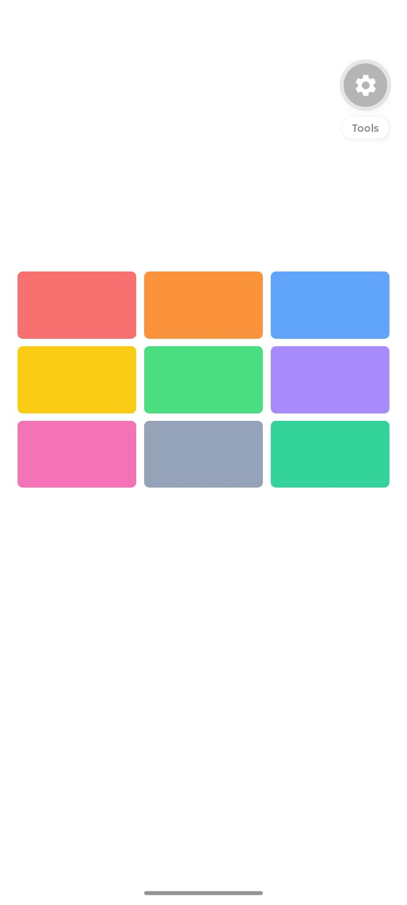
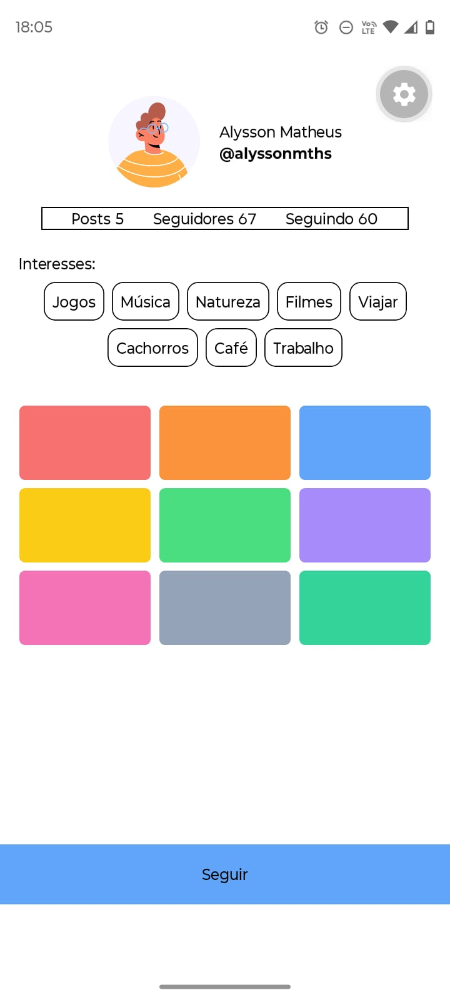

# Atividade de Flexbox

Projeto desenvolvido para a disciplina de Programação para Dispositivos Móveis, reunindo a resolução de exercícios práticos com React Native e Expo.

## Como executar

Instale as dependências do projeto:

```bash
npm install
```

Inicie o projeto:

```bash
npm start
```

Também é possível executar diretamente em uma plataforma específica:

```bash
npm run android
npm run ios
npm run web
```

## Componente `<IconeComTexto>`


## Componente `<LinhaDeAcoes>`


## Componente `<ListaDeChips>`


## Componente `<GradeDePublicacoes>`



## Botão de estado `<BotaoSeguir>`


## Desafio Final `<TelaPerfil>`


